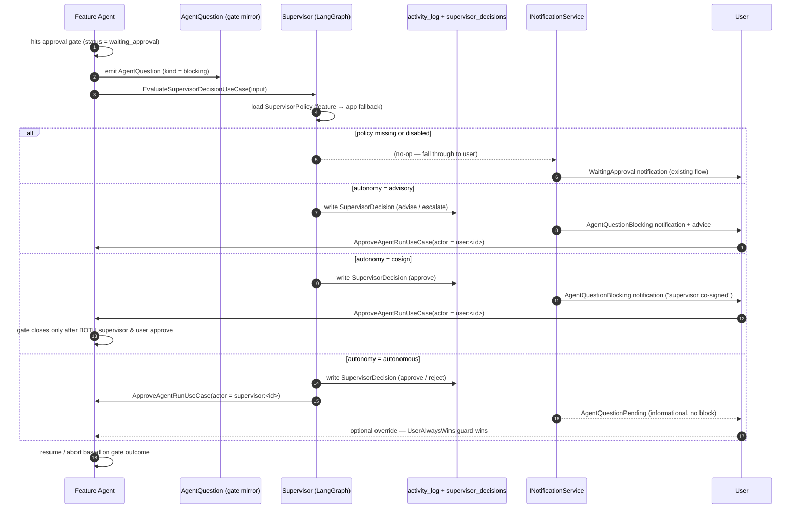
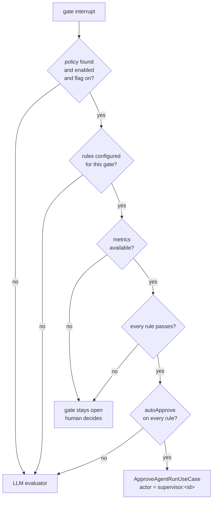

# Agent Collaboration & Supervision

> Spec: [`specs/093-agent-collaboration-supervision/`](../../specs/093-agent-collaboration-supervision/)
> — see `feature.yaml`, [`research.yaml`](../../specs/093-agent-collaboration-supervision/research.yaml),
> and [`plan.yaml`](../../specs/093-agent-collaboration-supervision/plan.yaml).

This document describes the **collaboration & supervision fabric** that lets
Shep agents talk to each other while they work, lets a delegated **supervisor
agent** monitor and intervene on the user's behalf, and surfaces every agent
question (interactive or background) in a single unified inbox.

The whole surface is gated behind the `collaboration` feature flag.
With the flag off, behavior is byte-identical to a vanilla Shep install.

---

## Three capabilities, one fabric

The user question that motivated this feature was simple:

1. *Can agents talk to each other while they work?*
2. *Can I place a supervisor agent on my behalf?*
3. *What happens when agents want to ask questions?*

These map onto three intertwined capabilities sharing one infrastructure:

| Capability | Domain entity | Port | Storage |
|---|---|---|---|
| Agent-to-agent messaging | `AgentMessage` | `IAgentMessageBus` | `agent_messages` |
| Unified question pipeline | `AgentQuestion` | `IAgentQuestionService` | `agent_questions` |
| Delegated supervisor agent | `SupervisorPolicy`, `SupervisorDecision` | `ISupervisorAgent` | `supervisor_policies`, `supervisor_decisions` |

All three follow Shep's standard pipeline: TypeSpec model → SQLite migration →
repository → application port → use case → infrastructure adapter → SSE event
kind → CLI + Web surface.

---

## Topology — hub-and-spoke

Inter-agent traffic is **hub-and-spoke**, not peer-to-peer. The bus rejects
peer addressing in v1; messages target one of:

- `broadcast` (per app/feature)
- `supervisor`
- `user`
- a specific `agentRunId` only as a reply (matched via `correlationId`)

When a `SupervisorPolicy` exists for the app/feature scope, the supervisor
evaluates routed messages and may emit follow-on decisions. When no policy is
configured, a `NullSupervisor` records the message in `activity_log` but
performs no policy evaluation.

This matches the [team-execution
protocol](../../specs/014-ui-sidebar/team-execution.md) draft (the EM hub) and
keeps audit centralized. Reply round-trips are direct via `correlationId` so
high-frequency exchanges don't bottleneck on the hub.

```
       ┌──────────┐         ┌──────────┐         ┌──────────┐
       │ Agent A  │         │ Agent B  │         │ Agent C  │
       │ (run-1)  │         │ (run-2)  │         │ (run-3)  │
       └────┬─────┘         └────┬─────┘         └────┬─────┘
            │                    │                    │
            │   publish/listen   │   publish/listen   │
            └──────────┬─────────┴──────────┬─────────┘
                       │                    │
                       ▼                    ▼
              ┌─────────────────────────────────────┐
              │  IAgentMessageBus (SQLite-backed)   │
              │  agent_messages table, WAL, polled  │
              └────────────────┬────────────────────┘
                               │
                  ┌────────────┴────────────┐
                  ▼                         ▼
          ┌────────────────┐       ┌─────────────────┐
          │ ISupervisorAgent│       │ SSE event stream│
          │  (policy hub)   │       │  (UI / CLI)     │
          └────────────────┘       └─────────────────┘
```

The **bus is cross-process by virtue of shared SQLite** — every worktree
process opens the same `~/.shep/<repo-hash>/shep.db` in WAL mode, so two
parallel feature agents in different worktrees coordinate by reading and
writing `agent_messages` without any new IPC primitive.

---

## Autonomy ladder

Every `SupervisorPolicy` carries an `autonomyLevel` that controls how much
authority the supervisor exercises:

| Level | Supervisor can | User must |
|---|---|---|
| `advisory` *(default)* | recommend (`advise` / `escalate`) | always act on every gate |
| `cosign` | recommend or pre-approve (`approve` / `reject`) | also approve before the gate passes |
| `autonomous` | close the gate directly (`approve` / `reject`) via the existing approve/reject use cases | nothing (but can override at any time) |

`autonomyLevel` is the per-policy default. Per-gate overrides live in
`gateAuthorityJson` (`prd` / `plan` / `merge` → autonomy override) so a user
can run the supervisor in `advisory` mode for PRD review but `autonomous` for
merges, all in the same policy.

`advisory` is the default for a brand-new install, because promoting the
supervisor to autonomous-by-default would silently change the trust contract
that today's approval gates establish.

### "User always wins" invariant

When the supervisor and the user disagree on a gate, **the user's decision is
final.** The supervisor's vote is recorded for audit but cannot override.

The invariant is enforced inside `ApproveAgentRunUseCase` and
`RejectAgentRunUseCase`: when the actor namespace is `supervisor:<id>`, the use
case looks up any prior user decision on the same gate; if one exists, the
supervisor's call is rejected with the rationale stored in the decision row.

This pattern keeps the existing `waiting_approval` state machine as the
**single source of truth** — the supervisor acts AS an actor inside it, not
alongside it. No new pause primitive was invented.

---

## Approval-gate flow with a supervisor



Key properties:

- **One state machine.** Every path resolves through the existing
  `waiting_approval` → `Approve` / `Reject` flow. The supervisor is just a new
  actor namespace.
- **Failure is fail-safe.** A timeout / model error / exception inside the
  supervisor MUST NOT block the agent. The graph publishes a
  `SupervisorDecision { verdict: 'escalate' }` and a `SupervisorFailed`
  notification — the human path proceeds immediately (FR-22).
- **Override is always reversible.** The user can call
  `RejectAgentRunUseCase(actor = user:<id>)` at any point; the prior-user-
  decision guard then refuses any subsequent supervisor action on the same
  gate.

---

## Deterministic guardrails (spec 111)

A supervisor can be configured with **deterministic** bounds that decide a gate
*before* the LLM evaluator runs. They exist because mathematical and path bounds
(`diff <= 250 lines`, zero blocked file paths, CI green) are exact, cost no
tokens, and must never be left to a model's judgement.

Rules live on `SupervisorPolicy.guardrailRulesJson` (a JSON array of
`GuardrailRule`, see `tsp/agents/fleet-guardrails.tsp`) and are set through
`ConfigureSupervisorUseCase`:

```jsonc
[
  {
    "id": "rule-low-risk-merge",
    "gate": "merge",              // prd | plan | merge | all
    "maxDiffLines": 250,
    "maxFilesChanged": 5,
    "blockedPathPatterns": ["**/auth/**", "**/migrations/**"],
    "requireCiPass": true,
    "autoApprove": true
  }
]
```

Evaluation is **conjunctive**: every rule matching the gate must pass. A rule
never short-circuits another, so adding a stricter rule can only make the
outcome safer. A rule with no criteria (`{ "gate": "all", "autoApprove": true }`)
passes trivially — that is the explicit "approve everything" configuration.



Three properties are deliberate:

- **Failing closed.** Unreadable stored rules, or diff/CI metrics that cannot be
  gathered, escalate instead of assuming "within bounds". Treating an unknown
  diff size as `0` would let a `maxDiffLines` rule pass.
- **A breach is terminal.** When a rule is violated the LLM is *not* consulted:
  a deterministic breach must never be overridable by a model verdict, or
  `never auto-approve changes to billing or auth` would be advisory only.
- **The default path is untouched.** With no rules configured — or with the
  policy disabled, or the `collaboration` flag off — the evaluator behaves
  exactly as it did before spec 111.

| Fact | Where |
|---|---|
| `GuardrailRule` / `GuardrailEvaluationResult` | `tsp/agents/fleet-guardrails.tsp` |
| Pure evaluator | `packages/core/src/application/use-cases/fleet/evaluate-gate-guardrails.use-case.ts` |
| Pre-LLM pass | `feature-agent-supervisor-gate-evaluator.ts` → `applyGuardrails()` |
| Rule storage | `supervisor_policies.guardrail_rules_json` (migration 144) |

---

## Circuit breaker → admission queue (spec 111)

The breaker watches agent-run failures in a rolling 15-minute window and trips on **4
consecutive failed runs**, or on a failure rate above **25%** across at least **4** finished runs
(the sample floor exists so one failure out of one run cannot park a fleet).

A trip does two things:

1. **Reports** — `circuitBreakerTripped` and its reason surface in `shep fleet status` and on the
   dashboard, as before.
2. **Acts** — when `FleetCircuitBreakerSettings.autoPauseQueue` is set, the trip **parks the
   admission queue**: no queued feature starts, and no manual start is admitted either, until the
   queue is released.

This closes the gap the original RFC described as *"auto-pauses the feature admission queue when
consecutive failures exceed threshold"*. It was weakened to a status signal only because
admission control did not exist yet when the breaker was written; `maxParallelFeatures` and
`AdmitQueuedFeaturesUseCase` landed in #847, so the pause now has something to stop.

### The pause is a separate record, never `maxParallelFeatures = 0`

`WorkflowConfig.maxParallelFeatures` is the user's own ceiling, and **`0` there means
unlimited**. Writing the pause as `maxParallelFeatures = 0` would therefore remove the cap and
admit everything — the opposite of pausing — and would destroy the ceiling the user configured,
so a resume could not restore it.

The pause is its own field, `WorkflowConfig.queuePaused` (`FleetQueuePause`: `pausedAt` +
`reason`, `settings.workflow_queue_pause`, migration 166). It is an **override laid over** the
ceiling, not a replacement for it:

| Question | Read |
|---|---|
| May another feature start? | `resolveMaxParallelFeatures()` → `0` while paused |
| Is that `0` "paused" or "unlimited"? | `isFleetQueuePaused()` — the number alone cannot tell them apart |
| What ceiling did the user configure? | `resolveConfiguredMaxParallelFeatures()` — persistence and the UI |

Admission is decided in exactly two places, `FeatureCapacityService.hasCapacity()` and
`claimSlot()`, and both consult `isFleetQueuePaused` **before** the limit. `claimSlot` refuses
while paused even for a caller passing `bypassLimit`: that flag is the user's "start anyway"
against the ceiling, and a fleet parked because everything is failing must not restart on the
strength of one forced start.

### The breaker cannot resume itself

`SetFleetQueuePauseUseCase` is the single writer. The breaker only ever **sets** the pause;
clearing it is an explicit user act (`shep fleet resume`). A fleet that tripped while the user
was asleep must not silently restart into the same failing conditions the moment the rolling
window happens to look healthy again.

Pausing is **idempotent and preserves the original `pausedAt`** — the breaker is re-evaluated on
every status read, so re-stamping would make a queue parked for an hour read as "paused just
now", forever. Resuming drains the queue, because clearing the pause opens admission without any
feature changing lifecycle.

Neither direction touches running agents. Like the cap, the pause governs **admission only**.

### Resuming has to *stick*: the acknowledgement timestamp

The breaker's metrics read a rolling window of `agent_runs`, and nothing in that history records
that a human has already looked at the failures. So a resume alone was not enough: the next
status read saw the same failing runs still inside the 15-minute window, tripped again, and
re-parked the queue with a fresh `pausedAt`. On the web that read happens on every dashboard
render and on **every SSE agent event**, so a resume was undone within seconds — the user was
locked out of their own lever for the rest of the window.

`WorkflowConfig.breakerAcknowledgedAt` (migration 167) records when the user last acknowledged a
trip, written in the same update that releases the queue. The breaker then judges only runs that
finished **after** that moment, so a trip means *"failures since you last looked"* — which is what
an operator expects a breaker to mean. A new failure after an acknowledgement trips again, so
acknowledging once cannot disarm the breaker.

The bound only ever **narrows** the window: a timestamp older than the window start (or one from a
machine with a fast clock) cannot make the breaker look further back than the window it
advertises, and an unparseable value is treated as absent so the breaker still trips rather than
silently going blind.

### Two failure definitions, deliberately

| Set | Statuses | Used by |
|---|---|---|
| `FAILURE_STATUSES` | `failed`, `interrupted` | the triage feed |
| `BREAKER_FAILURE_STATUSES` | `failed` | the breaker metrics |

`interrupted` is written by `StopAgentRunUseCase` when the user stops an agent, and by
crash/liveness reconciliation after a daemon restart. Counting it was harmless while the breaker
only reported a badge; now that a trip parks the whole fleet, a user who stops four agents in a
row — or restarts the daemon with four running — would park every repo by doing something
deliberate. The feed still shows interrupted runs, because a stopped run is a real thing to offer
a retry for.

### A scoped read reports, but never parks

`shep fleet status --repo <path>` evaluates the breaker over **one repository**, but the pause it
would write is **global**. Letting a scoped read trip it meant one repo's failures stopped work in
every other repo. A scoped read now reports the trip and leaves the lever to the fleet-wide read
(and to `shep fleet pause`).

### The pause only refuses work that takes a slot

`claimSlot` refuses while paused only when the target lifecycle **occupies a slot**.
`ResumeFeatureUseCase` passes `bypassLimit` for lifecycles outside the running set — resuming a
failed merge sitting in `Review`, for example — and those are not asking for capacity at all.
Refusing them would turn "stop starting new work" into "stop finishing work already in flight".

### The tripping read reports the pause it wrote

`overview.queuePaused` is taken from the **return value** of the pause, not from the settings read
at the top of `execute()`. That earlier read happened before the write, so the read that parked
the queue used to report TRIPPED with no PAUSED line — the user only found out on some later read,
and the `fleet status` example in `docs/cli/commands.md` documented a state the tripping read
could never produce.

| Fact | Where |
|---|---|
| `FleetQueuePause` | `tsp/domain/entities/fleet-overview.tsp` |
| Pause rule (`isFleetQueuePaused`, configured vs effective limit) | `packages/core/src/domain/shared/parallel-feature-limit.ts` |
| Single writer | `packages/core/src/application/use-cases/fleet/set-fleet-queue-pause.use-case.ts` |
| Trip → pause | `packages/core/src/application/use-cases/fleet/get-fleet-overview.use-case.ts` |
| Admission gate | `packages/core/src/application/use-cases/features/capacity/feature-capacity.service.ts` |
| Storage | `settings.workflow_queue_pause` (166), `settings.workflow_breaker_acknowledged_at` (167) |

---

## Unified question pipeline

`AgentQuestion` is the single surface for **every** agent-to-human ask, no
matter which execution mode raised it.

Two write paths converge here:

1. **Interactive sessions.** The Claude Code SDK V2 `canUseTool` interception
   in
   [`claude-code-interactive-executor.service.ts`](../../packages/core/src/infrastructure/services/agents/common/executors/claude-code-interactive-executor.service.ts)
   already excludes `AskUserQuestion` from auto-allowed tools, so every
   invocation hits the callback. The callback now calls
   `AskAgentQuestionUseCase` and awaits a `Deferred` registered in an
   in-process `DeferredQuestionRegistry`. When `AnswerAgentQuestionUseCase`
   resolves the row, the registry resolves the Promise and the SDK callback
   returns to the agent.
2. **Background feature agents.** Whenever
   [`feature-agent-worker.ts`](../../packages/core/src/infrastructure/services/agents/feature-agent/feature-agent-worker.ts)
   transitions a run to `waiting_approval`, it emits a parallel
   `AgentQuestion` of `kind = blocking` so the same gate appears in the
   unified inbox alongside interactive questions.

Both paths converge on `AnswerAgentQuestionUseCase`:

- Interactive mode → resolve the in-process `Deferred` so the SDK callback
  returns.
- Background mode → forward to `ApproveAgentRunUseCase` /
  `RejectAgentRunUseCase` with the appropriate actor.

### Three urgency tiers

Every `AgentQuestion` has a `kind`:

| Kind | UX |
|---|---|
| `info` | streams to the per-feature activity feed only — no notification |
| `question` | queued in the inbox; notification fires at user-controlled urgency; agent may auto-resolve to `defaultAnswer` after `expiresAt` |
| `blocking` | always raises a notification within ≤ 2s (NFR-10); the agent is paused until answered or cancelled |

The three tiers map cleanly onto the spec-014 vocabulary
(`[TASK-READY]`/`[BLOCKED]`/`[USER-UPDATE]`).

---

## Audit & explainability

Delegated authority without explainability is the fastest way to lose user
trust, so **every supervisor decision stores a full rationale.**

A `SupervisorDecision` row carries:

- `verdict` — `approve` | `reject` | `escalate` | `advise`
- `rationaleText` — free-form prose written by the evaluator
- `modelId` — the LLM the evaluator ran on (e.g. `claude-sonnet-4`)
- `promptVersion` — version stamp on the evaluator prompt
- `ruleRef` *(optional)* — the policy rule that fired
- `confidence` *(optional)* — 0–1 self-reported confidence
- `sourceEventKind` / `sourceEventId` — what triggered the evaluation
- `supervisorRunId` — the supervisor's own `agent_runs` row

Each row is **mirrored into `activity_log`** (the immutable audit table from
migration 064) with `actor_id = "supervisor:<id>"`, so the supervisor's
decisions appear next to user actions in the same chronological feed and can
never be silently rewritten.

In the web UI, the **"Why?"** drawer
([`supervisor-decision-why-drawer.tsx`](../../src/presentation/web/components/supervisor/supervisor-decision-why-drawer.tsx))
opens on every gate or question that has a decision attached. It renders the
full chronological audit (verdict + rationale + model/prompt versions) so the
user can inspect why the supervisor did what it did, even months later after
the model has rotated.

---

## Configuration scope

`SupervisorPolicy` is keyed by `(appId, featureId NULLABLE)` and resolves
**feature-first, then app-fallback**. A user can:

- set a default policy at the app level (`/application/<id>/supervisor`), and
- override it for a specific feature
  (`/application/<id>/supervisor?feature=<featureId>`).

This matches every existing scoping decision in Shep (Settings, ApprovalGates,
AgentDefinition all cascade app → feature) so there is one mental model for
all configuration.

The CLI has parity with web:

- `shep supervisor configure` — write/update a policy
- `shep supervisor enable` / `shep supervisor disable` — flip the toggle
- `shep supervisor status` — show resolved policy
- `shep supervisor approve` / `shep supervisor reject` — drive a gate from a
  scripted/cron context

The web surface lives at:

- `/application/[id]/supervisor` — config form (autonomy, model, prompt
  version, per-gate authority)
- `/agent-questions` — unified inbox across all apps
- per-feature **Agent Activity** panel — message timeline + inline "Why?"
  affordance on supervisor decisions

Both consume the **same use cases** (`ConfigureSupervisorUseCase`,
`GetSupervisorPolicyUseCase`, `ListAgentQuestionsUseCase`,
`AnswerAgentQuestionUseCase`, etc.). No business logic lives in CLI or Web —
they are thin adapters over the use-case API, per
[`.claude/rules/code-quality.md`](../../.claude/rules/code-quality.md).

---

## Notification routing

Supervisor escalations and pending questions reach the user through the
existing `INotificationService`. The collaboration fabric adds five new
`NotificationEventType` values (defined in
[`tsp/common/enums/notification.tsp`](../../tsp/common/enums/notification.tsp)):

- `agent_question_pending`
- `agent_question_blocking`
- `agent_message_blocked`
- `supervisor_escalated`
- `supervisor_failed`

Each kind is exposed as a boolean in `Settings.notifications.events`, so users
can mute any of them per channel (in-app / desktop / browser). No parallel
delivery channel was built — the existing notification surface is the single
mental model for every agent-driven alert.

---

## SSE event extensions

Three new event kinds are streamed through the existing
`StreamAgentEventsUseCase` (default 2s poll, opt-in 500ms for
blocking-priority subscriptions):

- `agent_message`
- `agent_question`
- `supervisor_decision`

Each is computed by a dedicated helper (`computeMessageDeltas`,
`computeQuestionDeltas`, `computeDecisionDeltas`) that mirrors the existing
`computeFeatureDeltas` / `computePrDeltas` / `computeStatusDeltas` shape, so
the web Service Worker fans them out to every tab through the same multiplex
without any transport changes.

---

## Feature flag

The whole surface lives behind `FeatureFlags.collaboration`:

- TypeSpec field on `FeatureFlags` in
  [`tsp/domain/entities/settings.tsp`](../../tsp/domain/entities/settings.tsp).
- SQLite column `feature_flag_collaboration` on `settings`
  (migration 091).
- Env override `NEXT_PUBLIC_FLAG_COLLABORATION` (DB-primary; env is fallback).

With the flag **off**:

- New use cases short-circuit at their entry guards (return
  `{ enabled: false }`).
- New web routes return 404.
- New CLI subcommands print "feature is disabled".
- No new SSE event kinds are emitted.
- No new tables are written.
- Notification preferences default to *off* for the new event kinds.

This satisfies NFR-14 — byte-identical default behavior.

---

## Where to look in code

| Layer | Path |
|---|---|
| TypeSpec models | `tsp/agents/agent-message.tsp`, `agent-question.tsp`, `supervisor-policy.tsp`, `supervisor-decision.tsp` |
| Generated types | `packages/core/src/domain/generated/output.ts` |
| Value objects | `packages/core/src/domain/value-objects/supervisor-actor.ts` |
| Output ports | `packages/core/src/application/ports/output/agents/` (`agent-message-bus`, `agent-question-service`, `supervisor-agent`) |
| Repository ports | `packages/core/src/application/ports/output/repositories/` (`agent-message-repository`, `agent-question-repository`, `supervisor-policy-repository`, `supervisor-decision-repository`) |
| Use cases | `packages/core/src/application/use-cases/agents/` (`send-agent-message`, `ask-agent-question`, `answer-agent-question`, `cancel-agent-question`, `list-agent-questions`, `escalate-to-user`, `configure-supervisor`, `enable-supervisor`, `disable-supervisor`, `get-supervisor-policy`, `evaluate-supervisor-decision`) |
| SSE deltas | `packages/core/src/application/use-cases/agents/stream-agent-events/compute-{message,question,decision}-deltas.ts` |
| Supervisor agent | `packages/core/src/infrastructure/services/agents/supervisor-agent/` (`supervisor-graph.ts`, `supervisor-agent-worker.ts`, `evaluator-prompt.ts`, `stub-supervisor-executor.ts`) |
| Approval-gate hooks | `packages/core/src/application/use-cases/agents/approve-agent-run.use-case.ts`, `reject-agent-run.use-case.ts` |
| SQLite migrations | `087-create-agent-messages.ts`, `088-create-agent-questions.ts`, `089-create-supervisor-policies.ts`, `090-create-supervisor-decisions.ts`, `091-add-feature-flag-collaboration.ts` |
| CLI commands | `src/presentation/cli/commands/supervisor/`, `src/presentation/cli/commands/agent/{message,questions}/` |
| Web routes | `src/presentation/web/app/application/[id]/supervisor/page.tsx`, `src/presentation/web/app/agent-questions/page.tsx` |
| Web components | `src/presentation/web/components/{supervisor,agent-questions,agent-activity}/` |

---

## Related

- [Agent system architecture](./agent-system.md)
- [AGENTS.md](../../AGENTS.md) — agent resolution rules + supervisor actor
  namespace
- [Spec 014 team-execution protocol](../../specs/014-ui-sidebar/team-execution.md)
- [Clean Architecture](./clean-architecture.md)
