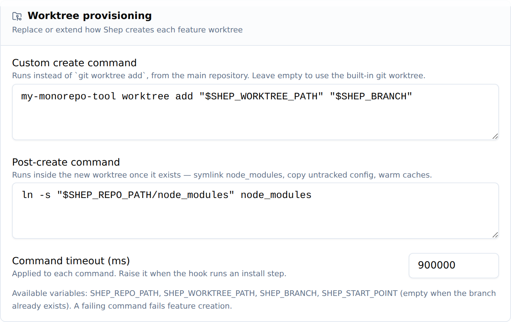

# Custom Worktree Provisioning

Every Shep feature runs in its own isolated git worktree under
`~/.shep/repos/<repo-hash>/wt/<branch-slug>`. By default Shep creates it with
`git worktree add`, which is a plain checkout — no `node_modules`, no untracked
`.env`, no build caches.

That is fine for most repositories and wrong for some:

- **Monorepos** that resolve dependencies from a single hoisted `node_modules`
  at the workspace root. A fresh worktree has none, and re-installing per
  feature is slow (or impossible offline).
- **Projects with native or path-sensitive tooling** that only build from a
  prepared directory.
- **Teams with an existing worktree tool** — a script that already knows how to
  lay down a tree correctly for that repository.

Two settings cover these cases. Both live under **Settings → Worktree** in the
web UI and are persisted in `settings.worktree`.



They are also configurable from the CLI with `shep settings worktree` — see
[Configuring from the CLI](#configuring-from-the-cli) below.

## The two hooks

| Setting             | Replaces `git worktree add`? | Working directory | Typical use                                       |
| ------------------- | ---------------------------- | ----------------- | ------------------------------------------------- |
| `createCommand`     | Yes                          | Main repository   | Hand provisioning to your own tool                 |
| `postCreateCommand` | No — runs after              | The new worktree  | Symlink `node_modules`, copy config, warm caches   |

Both are plain shell command lines. Shep runs them through the platform shell
(`cmd.exe` on Windows, the POSIX shell elsewhere), so pipes, `&&`, quoting, and
variable expansion all work.

Leaving both empty keeps the built-in `git worktree add` behaviour — this
feature is entirely opt-in.

## Environment variables

Both commands receive the process environment plus:

| Variable             | Value                                                                   |
| -------------------- | ----------------------------------------------------------------------- |
| `SHEP_REPO_PATH`     | Absolute path of the main repository clone                               |
| `SHEP_WORKTREE_PATH` | Absolute path the worktree must exist at when the command finishes       |
| `SHEP_BRANCH`        | Branch that must be checked out in the worktree                          |
| `SHEP_START_POINT`   | Start ref for a **new** branch; **empty** when the branch already exists |

`SHEP_START_POINT` is the signal that tells a `createCommand` which git
operation to perform: create the branch when it is set, check out the existing
branch when it is empty (this happens when Shep adopts an existing branch).

## Examples

### Symlink a hoisted `node_modules` (monorepo)

Leave `createCommand` empty and set:

```sh
ln -s "$SHEP_REPO_PATH/node_modules" node_modules
```

The command runs with the worktree as its working directory, so the relative
`node_modules` target lands inside the new tree.

For a pnpm workspace where each package has its own `node_modules`, link them
all:

```sh
for dir in packages/*; do
  [ -d "$SHEP_REPO_PATH/$dir/node_modules" ] && ln -s "$SHEP_REPO_PATH/$dir/node_modules" "$dir/node_modules"
done
ln -s "$SHEP_REPO_PATH/node_modules" node_modules
```

### Copy untracked local config

```sh
cp "$SHEP_REPO_PATH/.env.local" . 2>/dev/null || true
```

### Hand provisioning to your own tool

```sh
my-monorepo-tool worktree add "$SHEP_WORKTREE_PATH" "$SHEP_BRANCH" ${SHEP_START_POINT:+--from "$SHEP_START_POINT"}
```

A `createCommand` must leave a usable checkout at `$SHEP_WORKTREE_PATH`. Shep
verifies the directory exists and then looks the tree up in
`git worktree list`; if your tool produced something git does not register as a
worktree of the main repository (a shared clone, for example), Shep falls back
to inspecting the directory directly rather than failing.

Prefer wrapping `git worktree add` inside your tool where you can — `shep`
removes worktrees with `git worktree remove`, which only works for real
worktrees.

## Configuring from the CLI

Everything the Settings page does is available headless:

```sh
shep settings worktree                                  # show current config
shep settings worktree --post-create-command '<cmd>'    # run <cmd> in each new worktree
shep settings worktree --create-command '<cmd>'         # replace `git worktree add`
shep settings worktree --timeout 900000                 # per-command timeout
shep settings worktree --clear                          # back to the built-in flow
```

Passing an empty string to either command flag clears just that command.

## Timeout and failure behaviour

`commandTimeoutMs` (default `300000` — 5 minutes) applies to each command
separately. Raise it if your hook runs an install step.

**A failing command fails feature creation.** This is deliberate: a worktree
whose setup did not complete produces confusing agent failures much later.
The error surfaced to the user carries the command, its exit message, and the
first 2000 characters of its combined stdout/stderr.

## Related

- [configuration.md](./configuration.md) — all other settings
- `tsp/domain/entities/settings.tsp` — `WorktreeConfig` model
