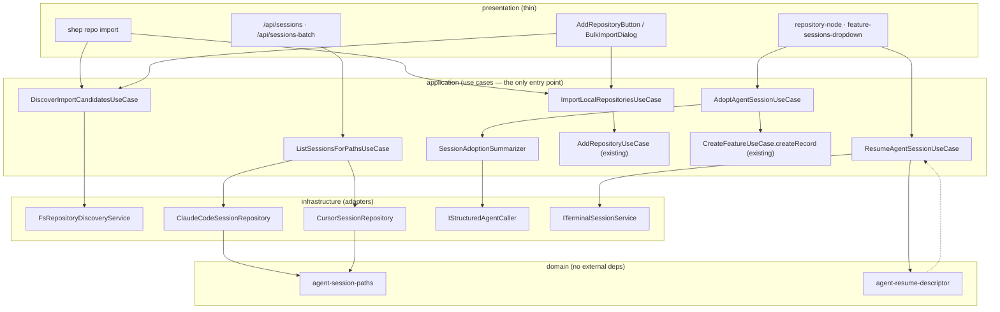

## Status

- **Phase:** Planning
- **Updated:** 2026-08-03

## Architecture Overview

Both halves follow the project's Clean Architecture dependency rule —
dependencies point inward, presentation talks only to use cases, and every
external concern (filesystem, provider session storage, the model) sits
behind an output port implemented in `infrastructure/`. See
[clean-architecture](../../docs/architecture/clean-architecture.md).

Two domain helpers carry the shared semantics that today are duplicated or
wrong. `agent-session-paths` owns the on-disk encoding conventions (Claude
Code's `[/\\.]` → `-`, Cursor's strip-leading-slash-and-dots, and the shep
worktree directory derived from `sha256(path)[0:16]`) so the core session
repositories and nothing else define them — this is the LESSONS.md rule that
shared config semantics belong in `domain/` before the second consumer
exists. `agent-resume-descriptor` owns the `AgentType` → binary mapping so
the terminal, IDE, and clipboard paths cannot disagree about how a session is
resumed.

## Implementation Strategy

**MANDATORY TDD**: every phase below that produces executable code follows
RED → GREEN → REFACTOR. Tests are written and failing before implementation.

**Phase 1 (Foundation)** is TypeSpec-first, per the project mandate. Both new
`Feature` fields and the new `AgentSession.filePath` field are declared in
`tsp/`, then `pnpm tsp:codegen` regenerates
`packages/core/src/domain/generated/output.ts` (never hand-edited). The umzug
migration and the `feature.mapper.ts` round-trip follow, copying the
`pragma table_info` guard pattern from migration 135. Nothing else can be
built until the generated types exist, so this phase is strictly first and
not parallel.

**Phases 2 and 3 are independent and may run concurrently.** They share no
files. Part A adds a discovery port plus two use cases in the repositories
slice; Part B core modifies the session repositories. Running them in
parallel is safe; running Phase 4 before Phase 3 is not.

**Phase 3 is the gate.** Research established that the web scanner is *ahead*
of core in three ways the canvas depends on — Cursor discovery, worktree
session collection, and `filePath` on the result. Phase 3 closes all three
and adds the batch use case that absorbs the fan-out logic currently living
in the `/api/sessions-batch` route (resolve repos + features, build path
specs, scan in parallel, 30s cache). Until this phase is green, Phase 5's
deletion of `session-scanner.ts` would silently regress the UI.

**Phase 4 delivers the priority path.** `AdoptAgentSessionUseCase` reads the
transcript through the existing `IAgentSessionRepository` port, delegates
derivation to `SessionAdoptionSummarizer` (which calls
`IStructuredAgentCaller` with a module-level JSON schema, mirroring
`MetadataGenerator`), and creates the feature via
`CreateFeatureUseCase.createRecord()` — the only path that yields a
`Requirements` feature with no worktree and no agent run. When the structured
call throws `StructuredCallError`, the summarizer falls back to deterministic
extraction so adoption degrades in quality, never in availability.

**Phase 5 is the only presentation phase.** It re-points the two API routes
at `ListSessionsForPathsUseCase`, deletes `session-scanner.ts`, strips the
prompt-building block out of `repository-node.tsx`, and replaces the
dropdown's clipboard-only actions with real adopt / resume-in-terminal /
open-in-IDE calls plus a corrected copyable command. Components stay thin:
they call server actions, they do not assemble prompts or commands.

## Files to Create/Modify

### New Files

| File | Purpose |
| ---- | ------- |
| `application/ports/output/services/repository-discovery-service.interface.ts` | Output port for enumerating subfolders + git detection |
| `infrastructure/services/repositories/fs-repository-discovery.service.ts` | `node:fs` adapter for the discovery port |
| `application/use-cases/repositories/discover-import-candidates.use-case.ts` | Lists candidates, annotates `isGitRepository` / `alreadyTracked` |
| `application/use-cases/repositories/import-local-repositories.use-case.ts` | Bulk import with per-path results |
| `domain/shared/agent-session-paths.ts` | Provider path-encoding + shep worktree dir derivation |
| `domain/shared/agent-resume-descriptor.ts` | `AgentType` → binary/args/cwd resume descriptor |
| `infrastructure/services/agents/sessions/cursor-session.repository.ts` | Real Cursor session discovery, replacing the stub |
| `application/use-cases/agents/list-sessions-for-paths.use-case.ts` | Batch path-keyed session lookup |
| `application/use-cases/agents/session-adoption-summarizer.ts` | Schema-validated transcript summarisation + fallback |
| `application/use-cases/agents/adopt-agent-session.use-case.ts` | Transcript → Feature in Requirements |
| `application/use-cases/agents/resume-agent-session.use-case.ts` | Resume descriptor + PTY session creation |
| `infrastructure/persistence/sqlite/migrations/140-add-source-session-to-features.ts` | Additive columns for session provenance |
| `presentation/cli/commands/repo/import.command.ts` | `shep repo import <dir>` |
| `presentation/web/app/actions/import-local-repositories.ts` | Server action for bulk import |
| `presentation/web/app/actions/adopt-agent-session.ts` | Server action for adoption |
| `presentation/web/components/common/bulk-import-dialog/` | Candidate list with selection + colocated stories |

### Modified Files

| File | Changes |
| ---- | ------- |
| `tsp/agents/agent-session.tsp` | Add `filePath?` |
| `tsp/domain/entities/feature.tsp` | Add `sourceAgentSessionId?`, `sourceAgentType?` |
| `sqlite/mappers/feature.mapper.ts` | Row type + `toRow` + `toDomain` for the new columns |
| `sessions/claude-code-session.repository.ts` | Worktree-aware collection; emit `filePath`; use the domain path helper |
| `sessions/codex-cli-session.repository.ts` | Emit `filePath` |
| `ports/output/agents/agent-session-repository.interface.ts` | `includeWorktrees` option on `ListSessionsOptions` |
| `di/modules/register-agents.ts` | Swap the Cursor stub for the real repository |
| `di/modules/register-use-cases.ts`, `register-services.ts` | Register new use cases + discovery service |
| `cli/commands/repo/index.ts` | Wire the import command |
| `api/sessions/route.ts`, `api/sessions-batch/route.ts` | Delegate to the batch use case; drop local fan-out and caching logic |
| `add-repository-button.tsx` | Third entry: import a folder of repos |
| `feature-sessions-dropdown.tsx` | Real adopt/resume/IDE actions; fix the `--project` command |
| `repository-node.tsx` | Delete the prompt-building block; call the server action |

### Deleted Files

| File | Reason |
| ---- | ------ |
| `src/presentation/web/lib/session-scanner.ts` | Duplicate of the core session repositories; superseded once Phase 3 closes the capability gaps |

## Testing Strategy (TDD: Tests FIRST)

**CRITICAL:** Tests are written FIRST in each TDD cycle.

### Unit Tests (RED -> GREEN -> REFACTOR)

- **Domain path helpers** — Claude encoding (`/`, `\`, `.` → `-`), Cursor
  encoding (leading slash stripped, dots removed), shep worktree dir from a
  known sha256 prefix. Pure functions, exhaustive edge cases, no mocks.
- **Resume descriptor** — one case per `AgentType`, asserting binary and
  argv; explicit assertion that no `--project` argument is ever produced and
  that the result is argv, not a shell string.
- **Discovery use case** — mocked discovery port: mixed git/non-git children,
  already-tracked annotation, empty folder, unreadable folder.
- **Bulk import use case** — mocked `AddRepositoryUseCase`: all-success,
  partial failure (one path throws, others still imported and reported),
  duplicate paths, empty selection.
- **Adoption summarizer** — mocked `IStructuredAgentCaller`: happy path
  returns schema fields; `StructuredCallError` triggers deterministic
  fallback; prompt is truncated.
- **Adoption use case** — asserts `createRecord` is called (never `execute`),
  that the resulting lifecycle is `Requirements`, that no worktree service is
  touched, and that provenance fields are persisted.
- **Session repositories** — temp-dir fixtures for Cursor's two layouts (flat
  `<id>.jsonl` and `<dir>/<dir>.jsonl`), malformed JSONL skipped rather than
  thrown, worktree dirs discovered, `filePath` populated.
- **Batch use case** — path-keyed map shape, per-path limit, repo paths get
  worktree inclusion while feature paths do not.

### Integration Tests

- Migration 140 applied against a real SQLite database: columns added,
  idempotent on re-run, `down()` is a safe no-op.
- `feature.mapper.ts` round-trip through the repository with and without the
  new provenance fields set.
- CLI `shep repo import` against a temp directory tree.

### Regression Guards

- `tests/unit/presentation/web/smoke-imports.test.ts` — mandatory because the
  two new `domain/shared/` helpers are consumed by both core and the web
  package, which resolves `domain/` as raw TypeScript. Per LESSONS.md, this
  is the only check that catches a `.js` specifier in a `domain/` file.
- `pnpm build:storybook` — new and changed web components carry colocated
  stories.

## Risk Mitigation

| Risk | Mitigation |
| ---- | ---------- |
| Deleting `session-scanner.ts` silently drops Cursor or worktree sessions from the canvas | Phase 3 closes all three capability gaps and is gated before Phase 5; session-repository tests assert worktree discovery and both Cursor layouts explicitly |
| Batch session lookup regresses canvas performance (polled every 30s per repo) | Preserve the stat-then-parse-top-N strategy and the 8KB head-read; keep the 30s cache semantics, moved into the use case rather than dropped |
| Adoption blocks on a slow or failing model call | Deterministic extraction fallback on `StructuredCallError`; adoption never hard-fails |
| Transcripts carry secrets into the model or the persisted feature | Truncate the prompt as `MetadataGenerator` does; persist derived summaries, never raw transcript content |
| `AgentType` gains a member and the resume mapping goes stale | Exhaustive per-member test over the enum, so a new member fails the suite rather than silently producing a wrong binary — the LESSONS.md enum-member rule |
| New `domain/shared/` helpers break the web bundler via `.js` specifiers | `domain/` relative imports carry no extension; smoke-imports test run before push |
| Touching long presentation files while adding to them | `feature-sessions-dropdown.tsx` is already ~310 lines; extract `SessionRow` and its actions into siblings before adding, per the refactor-before-extending rule |

## Rollback Plan

Phases 1–4 are strictly additive: new ports, use cases, domain helpers, two
nullable columns, and one swapped DI registration. Reverting the feature
branch restores prior behaviour with no data migration needed — the added
columns are nullable and ignored by older code, and `down()` is a no-op by
house convention.

Phase 5 is the only destructive step (the scanner deletion and the component
rewrite). If a session-discovery regression is found after merge, reverting
Phase 5's commits alone restores the web scanner while leaving the core
capabilities in place, because Phase 3 does not modify the scanner or its
callers.

---

_Updated by `/shep-kit:plan` — see tasks.yaml for detailed task breakdown_
