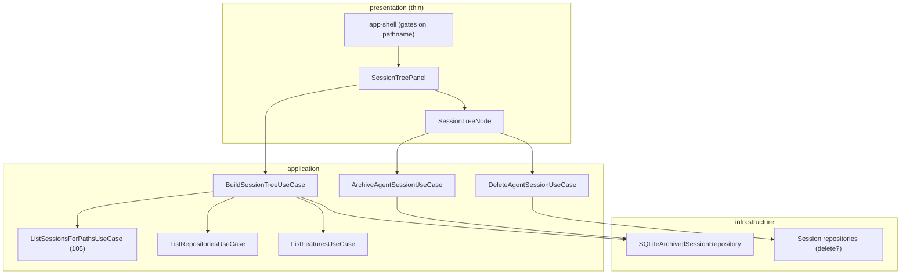

## Status

- **Phase:** Planning
- **Updated:** 2026-08-03

## Architecture Overview

Follows the project's Clean Architecture dependency rule — presentation talks
only to use cases, and provider storage sits behind an output port. See
[clean-architecture](../../docs/architecture/clean-architecture.md).

## Implementation Strategy

**MANDATORY TDD**: every phase producing executable code follows
RED → GREEN → REFACTOR.

**Ordered so the feature becomes visible early.** The user has asked twice
where the sidebar is; Phase 2 is deliberately the point at which it appears on
screen, before the mutation work in Phase 3. Phase 1 exists only because the
panel needs data to render.

**Phase 1 — tree data in core.** `BuildSessionTreeUseCase` composes
`ListRepositoriesUseCase`, `ListFeaturesUseCase`, and spec 105's
`ListSessionsForPathsUseCase`, then applies the one domain rule: a session is
adopted iff some feature's `sourceAgentSessionId` matches its id. Research
established that the adopted map is built from the feature list already being
walked, so no new repository method is required. The use case returns a
ready-to-render view model — presentation does no joining.

**Phase 2 — double sidenav on screen.** A second `Sidebar` renders as a
sibling inside the existing `SidebarProvider` (never a nested provider, which
would contend over one open state and one cookie), gated on `pathname` so only
the Control Center changes. The tree defaults to open. Nodes are purpose-built
rather than routed through `ui/file-tree.tsx`, whose `TreeViewElement` is a
filesystem shape that cannot carry agent type, adopted state, or per-node
actions.

**Phase 3 — sessions become mutable.** Archive first, because it is safe by
construction: a marker row in `archived_agent_sessions`, unarchive is a row
delete, provider files untouched. Delete second and separately: an optional
`delete?(id)` on the session port so the stub and unsupported providers are
not forced to implement a destructive operation, with per-provider
implementations that understand their own layout — including Cursor's
directory-per-transcript form. Deletion verifies the resolved path is inside
the expected provider root before unlinking, and must never cascade into the
feature adopted from that session.

**Phase 4 — validation**, mirroring CI locally before any push.

## Files to Create/Modify

### New Files

| File | Purpose |
| ---- | ------- |
| `application/use-cases/agents/build-session-tree.use-case.ts` | Joins repos + features + sessions into the tree view model |
| `application/ports/output/repositories/archived-session.repository.interface.ts` | Archive marker persistence port |
| `infrastructure/repositories/sqlite-archived-session.repository.ts` | SQLite adapter for the marker table |
| `migrations/141-create-archived-agent-sessions.ts` | Creates the marker table |
| `application/use-cases/agents/archive-agent-session.use-case.ts` | Archive / unarchive |
| `application/use-cases/agents/delete-agent-session.use-case.ts` | Deletes a provider transcript, guarded |
| `web/app/actions/session-tree.ts` | Server actions for the panel |
| `web/components/features/session-tree/` | Panel, nodes, and colocated stories |

### Modified Files

| File | Changes |
| ---- | ------- |
| `ports/output/agents/agent-session-repository.interface.ts` | Optional `delete?(id)` plus docs |
| `sessions/claude-code-session.repository.ts` | Implement `delete` (unlink JSONL) |
| `sessions/codex-cli-session.repository.ts` | Implement `delete` (unlink JSONL) |
| `sessions/cursor-session.repository.ts` | Implement `delete` (flat file or transcript dir) |
| `di/modules/register-use-cases.ts`, `register-repositories.ts` | Register the new use cases + repository |
| `layouts/app-shell/app-shell.tsx` | Render the second sidebar, gated on `pathname` |
| `translations/*/web.json` | New keys in all nine locales |

## Testing Strategy (TDD: Tests FIRST)

**CRITICAL:** Tests are written FIRST in each TDD cycle.

### Unit Tests (RED -> GREEN -> REFACTOR)

- **Tree building** — adopted vs unadopted bucketing; a session adopted by a
  feature nests under it; repos with no sessions; features with no adopted
  session; archived sessions excluded unless explicitly included; ordering.
- **Archive use case** — archive inserts, unarchive deletes, double-archive is
  idempotent, and no provider file is ever touched (asserted by giving the use
  case no filesystem collaborator at all).
- **Delete use case** — refuses when the provider lacks `delete`; refuses a
  path resolving outside the provider root; does not modify or delete the
  feature adopted from the session; returns a typed result when the transcript
  is already gone.
- **Provider delete** — temp-dir fixtures per provider, including Cursor's
  flat and directory-per-transcript layouts.
- **Panel/node components** — adopted badge rendering, archive and delete
  actions invoking their server actions, delete requiring confirmation.

### Integration Tests

- Migration 141 creates the table, is idempotent on re-run, and `down()` is a
  safe no-op.
- Archive repository round-trip: insert, query set, delete, re-query.

## Risk Mitigation

| Risk | Mitigation |
| ---- | ---------- |
| Deletion removes the wrong file, or escapes the provider directory | Resolve the path from the provider repository that owns the layout, assert containment within the provider root before unlinking, and cover with temp-dir tests per provider |
| Deleting a transcript damages the feature adopted from it | Explicit test that the feature survives; a dangling `sourceAgentSessionId` is accepted by design |
| Archive silently mutates provider data | The archive use case is given no filesystem collaborator, so it cannot |
| A second SidebarProvider breaks the existing rail | Single provider, sibling panel; research rejected nesting outright |
| The tree panel regresses non-Control-Center routes | Gated on `pathname`; existing app-shell tests must stay green |
| 20+ repositories make the tree slow | Compose the already-cached spec 105 use case; render session children per expanded node |
| New i18n keys break the completeness test | Add every key to all nine locales in the same change |

## Rollback Plan

Phases 1–2 are additive: one new use case, new components, and a conditional
render in app-shell. Reverting restores the single-sidebar Control Center.

Phase 3 introduces the only destructive capability. The marker table is
additive and nullable-by-absence, so reverting leaves orphan rows that nothing
reads. Transcript deletion cannot be rolled back by code — which is why it is
confirmation-gated rather than reversible.

---

_Updated by `/shep-kit:plan` — see tasks.yaml for detailed task breakdown_
